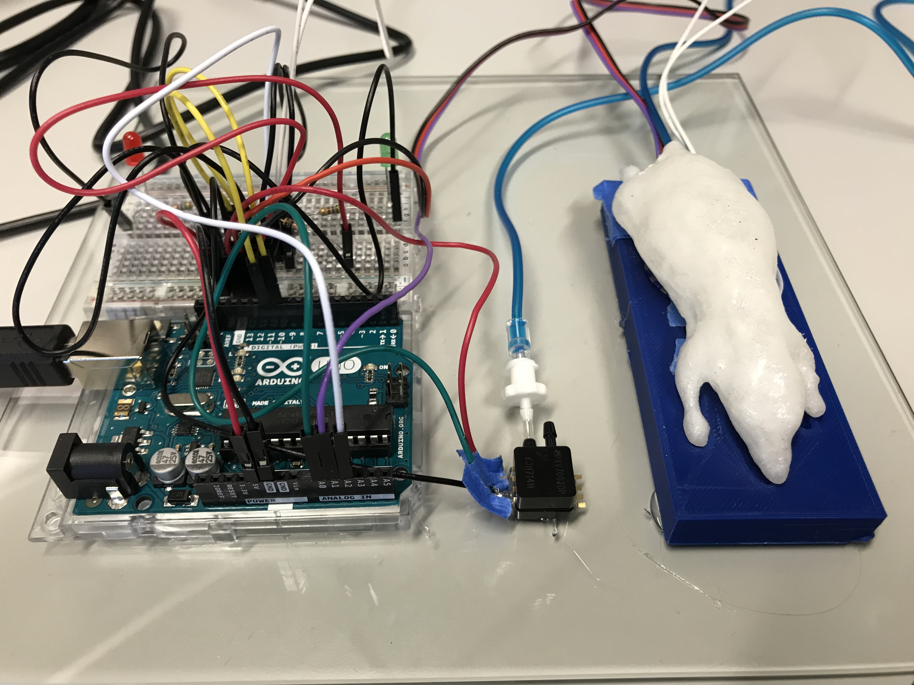
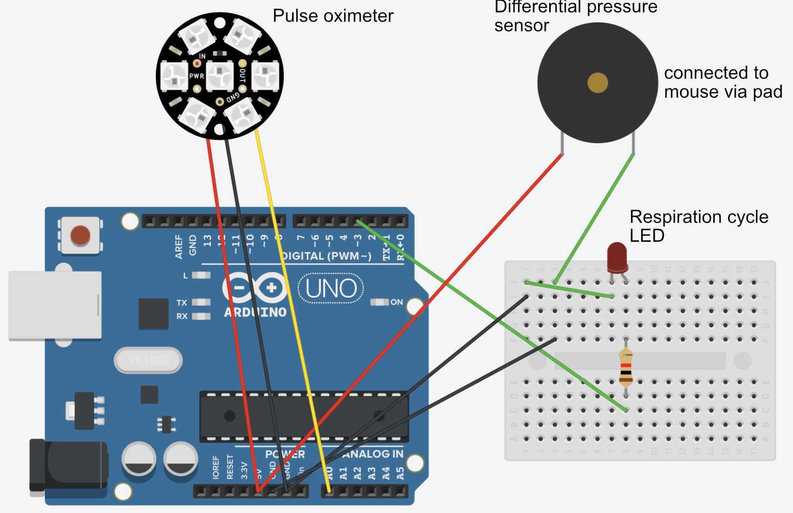

## Team Members

## Synopsis

The aim of this project is the development and implementation of a low-cost rodent physiology monitor which is suitable for a wide range of animal experiments and imaging applications. Parameters such as Heart Rate (HR), Respiratory Rate (RR), and Temperature will be presented to the user and can be fed (via an interface) into other systems. These include Magnetic Resonance Imaging (MRI) and Computed Tomography (CT) which often require gating information such as HR and RR to reduce motion artefacts. The rodents (primarily mice) will be placed in a bed which contains all the required sensors therefore removing the need for any further setup by the user. The bed will be designed to be compatible with scenarios ranging from anesthesia induction to image acquisition. Existing solutions are in the cost range of several thousand pounds and do not support the holistic workflow required in animal experiments.

## Software

Explain functionality of software components (if any) as concisely as possible, developers should be able to figure out how your project solves their problem by looking at the code example. Ideally, this should be pseudo code or an abstract graphical representation of your code e.g entity relationship diagram. Consider adding a screenshot of your User Interface.

## Hardware

Explain how the hardware components (if any) of your project function as concisely as possible, including a short description of fabrication and assembly. Component suppliers and part numbers should be provided separately in a bill of materials, in a 'Hardware Folder'.

## Installation, Maintenance and Testing Guide

Provide instructions on usage, describe a test scheme and show how to run the tests with code and hardware configuration examples with some representative results.

## License

This project is published under the GNU General Public License v3.0. You can find the license in the corresponding project folder.
